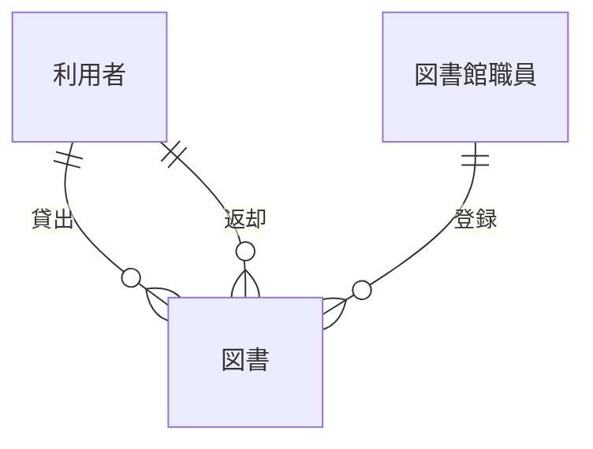
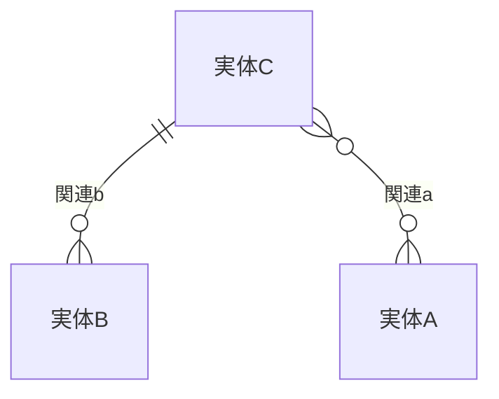

```mermaid
erDiagram
    "利用者" ||--o{ "図書" : "貸出"
    "利用者" ||--o{ "図書" : "返却"
    "図書館職員" ||--o{ "図書": "登録"

```

```mermaid
erDiagram
    "実体C" ||--o{ "実体B" : "関連b"
    "実体C" }o--o{ "実体A" : "関連a"
```